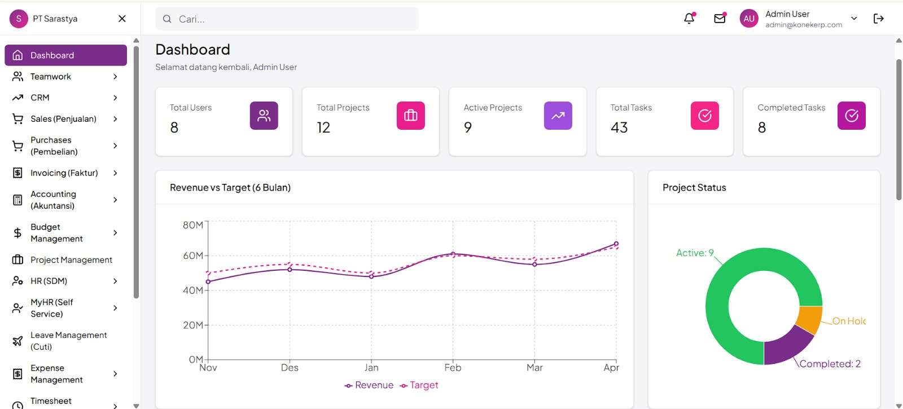
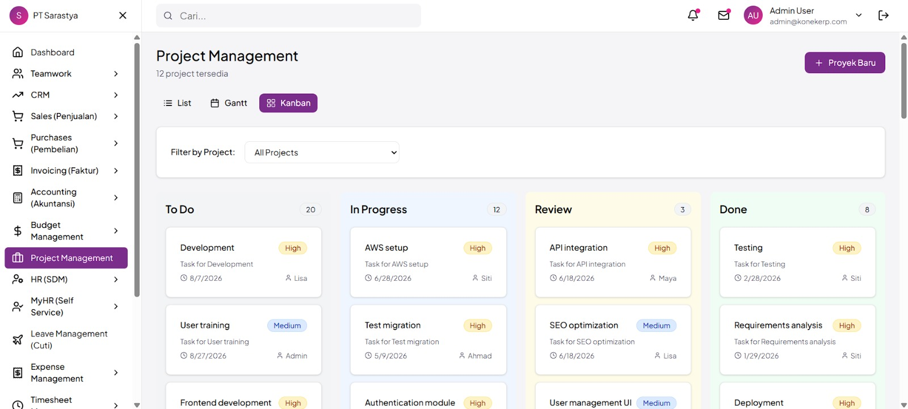
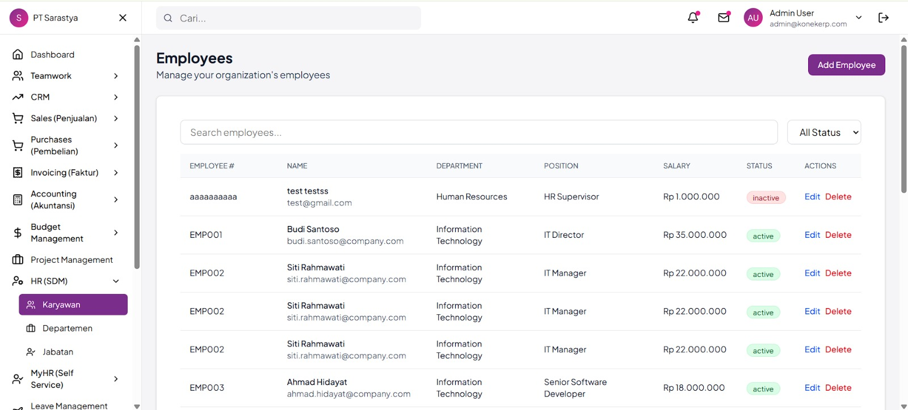
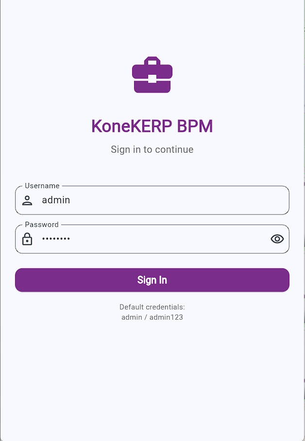
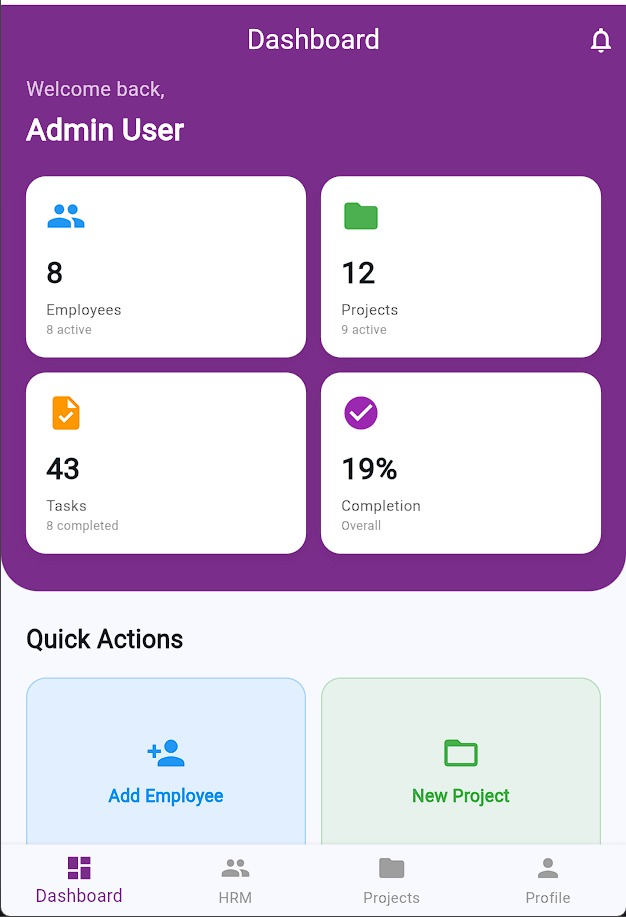
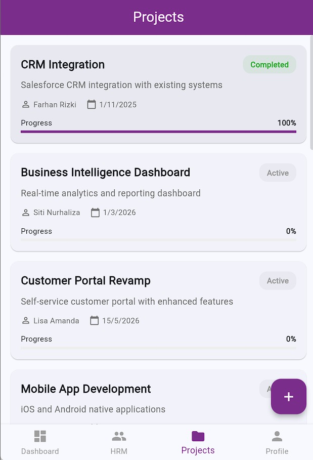

# 🏢 ERPBPM - Enterprise Resource Planning & Business Process Management

Full-stack ERP & BPM system dengan backend ASP.NET Core, frontend React (Web), dan Flutter (Mobile).


---

## 📋 Deskripsi Proyek

ERPBPM adalah sistem manajemen perusahaan terintegrasi yang mencakup:

- **HRM (Human Resource Management)** - Manajemen karyawan, departemen, dan posisi
- **Project Management** - Manajemen proyek dengan Kanban Board dan Gantt Chart
- **Task Management** - Pengelolaan tugas dengan prioritas dan status
- **Dashboard & Reporting** - Visualisasi data dan laporan real-time
- **Authentication & Authorization** - Sistem login dengan JWT dan role-based access

### ✨ Fitur Utama

- 📊 Dashboard interaktif dengan KPI cards
- 👥 Manajemen karyawan lengkap (CRUD)
- 📁 Project management dengan visual boards
- ✅ Task tracking dengan status dan prioritas
- 📱 Mobile app untuk akses on-the-go
- 🔐 Secure authentication dengan JWT
- 🌐 RESTful API dengan Swagger documentation
- 📈 Real-time reporting dan analytics

---

## 🏗️ Arsitektur Sistem

### Monorepo Structure

```
erpbpm/
├── backend/              # ASP.NET Core Web API
│   ├── src/
│   │   ├── ERPBPM.API           # Controllers, Middleware
│   │   ├── ERPBPM.Application   # Services, DTOs, Validators
│   │   ├── ERPBPM.Domain        # Entities, Enums
│   │   └── ERPBPM.Infrastructure # Repositories, DbContext
│   └── Dockerfile
│
├── frontend-web/         # React + Vite + TailwindCSS
│   ├── src/
│   │   ├── app/                 # Router, Layouts
│   │   ├── features/            # Feature modules
│   │   └── shared/              # Components, Utils
│   └── package.json
│
└── frontend-mobile/      # Flutter Mobile App
    ├── lib/
    │   ├── core/                # DI, Network, Theme
    │   └── features/            # Feature modules
    └── pubspec.yaml
```

### Design Patterns

- **Backend**: Clean Architecture, Repository Pattern, CQRS
- **Frontend Web**: Feature-based architecture, Zustand state management
- **Frontend Mobile**: Clean Architecture, BLoC pattern

---

## 🛠️ Tech Stack

### Backend
- **Framework**: ASP.NET Core 8.0
- **Database**: PostgreSQL 15
- **ORM**: Entity Framework Core
- **Authentication**: JWT Bearer Token
- **Validation**: FluentValidation
- **Logging**: Serilog
- **API Documentation**: Swagger/OpenAPI

### Frontend Web
- **Framework**: React 18.3
- **Build Tool**: Vite 6.3
- **Styling**: TailwindCSS 4.1
- **UI Components**: Radix UI, shadcn/ui
- **State Management**: Zustand
- **HTTP Client**: Axios
- **Routing**: React Router v7

### Frontend Mobile
- **Framework**: Flutter 3.x
- **State Management**: BLoC Pattern
- **HTTP Client**: Dio
- **Local Storage**: Shared Preferences
- **UI**: Material Design 3

---

## 🚀 Quick Start

### Prerequisites

- **Backend**: .NET 8.0 SDK, PostgreSQL 15
- **Frontend Web**: Node.js 18+, npm/pnpm
- **Frontend Mobile**: Flutter SDK 3.x, Android Studio/Xcode

### 1. Clone Repository

```bash
git clone https://github.com/yourusername/erpbpm.git
cd erpbpm
```

### 2. Setup Backend

```bash
cd backend

# Restore dependencies
dotnet restore

# Update database connection string
# Edit: src/ERPBPM.API/appsettings.json

# Run migrations (auto-seed included)
dotnet run --project src/ERPBPM.API
```

Backend akan berjalan di: `http://localhost:5000`
Swagger UI: `http://localhost:5000/swagger`

**Default Login:**
- Email: `admin@erpbpm.com`
- Password: `Admin123!`

### 3. Setup Frontend Web

```bash
cd frontend-web

# Install dependencies
npm install

# Create .env file
cp .env.example .env

# Edit .env
# VITE_API_URL=http://localhost:5000

# Run development server
npm run dev
```

Frontend akan berjalan di: `http://localhost:5173`

### 4. Setup Frontend Mobile

```bash
cd frontend-mobile

# Install dependencies
flutter pub get

# Update API URL
# Edit: lib/core/constants/api_constants.dart

# Run on emulator/device
flutter run
```

---

## 🌐 Deployment

### Production URLs

- **Backend API**: https://erpbpm-backend.onrender.com
- **Frontend Web**: https://erpbpm-frontend.onrender.com
- **Mobile APK**: [Download APK](./frontend-mobile/build/app/outputs/flutter-apk/app-release.apk)

### Deployment Guide

Lihat [DEPLOYMENT_GUIDE.md](./DEPLOYMENT_GUIDE.md) untuk instruksi lengkap deployment ke Render.com

---

## 📱 Screenshots

### Web Application

#### Dashboard


#### Project Management - Kanban Board


#### Employee Management


### Mobile Application

<p float="left">
  
  
  
</p>

---

## 📚 Documentation

- [Backend README](./backend/README.md) - Setup dan API documentation
- [Frontend Web README](./frontend-web/README.md) - Setup dan component guide
- [Frontend Mobile README](./frontend-mobile/README.md) - Setup dan build guide
- [Deployment Guide](./DEPLOYMENT_GUIDE.md) - Production deployment
- [API Guide](./API_GUIDE.md) - API endpoints documentation

---

## 🧪 Testing

### Backend Tests
```bash
cd backend
dotnet test
```

### Frontend Web Tests
```bash
cd frontend-web
npm run test
```

### Mobile Tests
```bash
cd frontend-mobile
flutter test
```

---

## 📦 Build for Production

### Backend
```bash
cd backend
dotnet publish -c Release -o ./publish
```

### Frontend Web
```bash
cd frontend-web
npm run build
# Output: dist/
```

### Mobile APK
```bash
cd frontend-mobile
flutter build apk --release
# Output: build/app/outputs/flutter-apk/app-release.apk
```

---

## 🤝 Contributing

1. Fork the repository
2. Create feature branch (`git checkout -b feature/AmazingFeature`)
3. Commit changes (`git commit -m 'Add some AmazingFeature'`)
4. Push to branch (`git push origin feature/AmazingFeature`)
5. Open Pull Request

---

## 📄 License

This project is licensed under the MIT License - see the [LICENSE](LICENSE) file for details.

---

## 👥 Team

- **Backend Developer** - ASP.NET Core API
- **Frontend Developer** - React Web App
- **Mobile Developer** - Flutter App
- **DevOps** - Deployment & CI/CD

---

## 📞 Support

Untuk pertanyaan atau dukungan:
- Email: support@erpbpm.com
- Issues: [GitHub Issues](https://github.com/yourusername/erpbpm/issues)

---

## 🎯 Roadmap

- [x] Authentication & Authorization
- [x] HRM Module
- [x] Project Management
- [x] Task Management
- [x] Dashboard & Reporting
- [x] Mobile App
- [ ] Workflow Automation
- [ ] Document Management
- [ ] Real-time Notifications
- [ ] Advanced Analytics
- [ ] Multi-language Support

---

**Made with ❤️ by ERPBPM Team**
